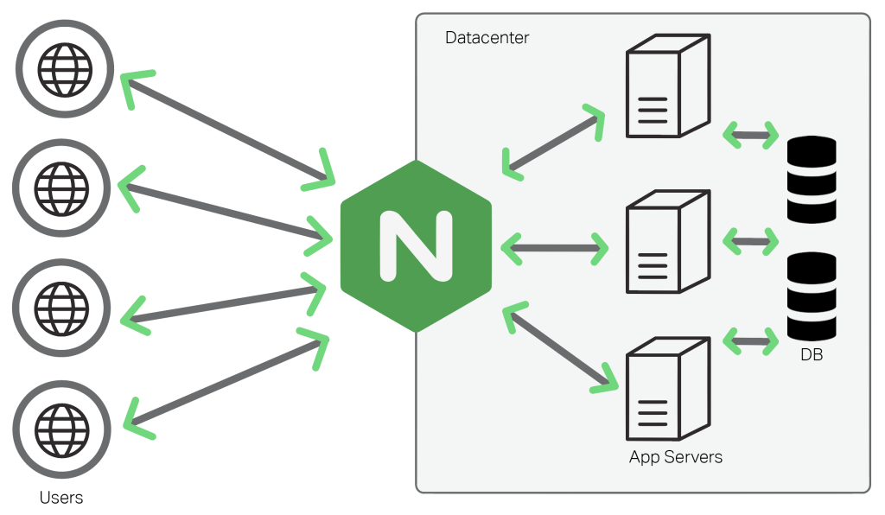

## 1. Nginx란?

### Nginx는 경량 웹(web server) 서버이다.

> 웹서버는 웹 브라우저와 같은 클라이언트로부터 HTTP 요청을 받아들이고, HTML 문서와 같은 웹 페이지를 반환하는 컴퓨터 프로그램이다. 
> 
> 웹 서버의 주된 기능은 웹 페이지를 클라이언트로 전달하는 것이다. 
> 주로 그림, CSS, 자바스크립트를 포함한 HTML 문서가 클라이언트로 전달된다.
> - 출처: [위키백과](https://ko.wikipedia.org/wiki/%EC%9B%B9_%EC%84%9C%EB%B2%84)

웹서버는 통상적으로 클라이언트에게 정적인 자원을 전달(서빙)하는 서버이다.  
정적인 자원이란 HTTP, CSS, 이미지 같은 서버에 이미 존재하는 자원이다.  

Q) 그렇다면 웹서버가 아닌 서버는 어떤 것일까?  
A) 동적인 자원을 제공하거나, 통신과정에서 중계적인 역할을 하는 서버는 웹서버가 아니다.  

요즘 기준으로 API 서버가 대표적으로 웹서버가 아니다.
DB에 있는 자원을 응답하기 때문에 정적이 아니냐 생각 할 수 도 있다.  
하지만 API서버는 DB의 그대로 제공하는 것이 아닌 동적으로 가공하여 응답한다 때문에 웹서버로 보지 않고 API 서버라고 불린다.

API 서버가 주류가 되기 전에는 WAS(Web Application Server)가 대표적인 웹서버가 아닌 서버였다.
WAS는 클라이언트 요청에 맞는 페이지를 요청이 들어올 때 동적으로렌더링하여 응답하는 서버이다.  
- PHP는 .php 파일을 동적으로 렌더링하여 응답한다.
- JAVA는 .jsp 파일을 동적으로 렌더링하여 응답한다.
- .NET은 .aspx 파일을 동적으로 렌더링하여 응답한다.

중계서버인 프록시 서버와 게이트웨이 서버 또한 웹서버가 아니다.  
- 프록시 서버: 
	기본적인 동작은 클라이언트에서 전달받은 요청를 서버로 전달하고,  
	서버에서 받은 응답을 클라이언트에 전달하는 중계기의 역할을 한다.
- 케이트웨이 서버:
	게이트웨이는 프록시와 매우 유사한 중계 서버지만 주로 이기종 통신을 위해 사용한다.
	즉, 게이트웨이는 HTTP 프로토콜 외의 프로토콜과 통신 할 수 있도록 중계하는 서버이다.
### Nginx는 경량 웹 서버(web server)이다.
Nginx는 요청당 쓰레드를 생성하여 처리하는 서버가 주류일 때 비동기(Event-Driven 구조)를 사용하여 경량화 시킨 서버로 유명하다.
- 자바(Spring webflux 제외)의 서버와와 Nodejs를 비교 할 때 주로 나오는 것과 동일한 특징을 가진다.
### Nginx는 리버스 프록시 서버(Reverse Proxy Server)의 역할도 수행한다.
#### 포워드 프록시(Forward Proxy)
일반적으로 프록시라고 하면 포워드 프록시를 말한다.  
클라이언트가 서버로 요청할 때 직접 요청하지 않고 먼저 프록시 서버를 통해 요청을 수행한다.  
예를 들어 회사 인트라넷에서 인터넷을 사용할때 포워드 프록시를 먼저 호출하여 사용한다.  
이 경우는 서버에게 클라이언트가 누구인지 감추는 역할을 수행한다.  

#### 리버스 프록시(Reverse Proxy)
리버스 프록시는 포워드 프록시와 반대로 **인터넷과 서버 사이에서 동작**한다.  
클라이언트가 요청을 하면 서버가 아닌 리버스 프록시가 요청을 먼저 받는다.  
- 리버스 프록시는 서버가 누구인지 감추고 보호하는 역할을 수행한다.
- 리버스 프록시는 **요청을 분산(로드 밸런싱))**하는 역할을 수행한다.
- 리버스 프록시는 요청에 대한 응답을 캐싱하여 응답하는 **캐시 서버**의 역할을 한다.
- 리버스 프록시는 **ssl을 사용하여 http 요청을 https 요청으로 변환**하는 역할을 수행한다.
- 리버스 프록시는 **인가 인증의 역할**을 수행할 수도 있다.
- 리버스 프록시는 **API gateway의 역할**을 수행할 수 있다.

### Nginx는 WAS서버의 부하를 줄일 수 있는 L7 로드 밸런서로 활용된다.   

로드 밸런서는 요청을 받아서 여러 서버(보통 동일한 서버)에 분산하는 역할을 한다.  
요청을 단일 서버에서 처리하는 경우 부하로 인해 해당 서버가 죽을 수 있다.  
요청을 처리할 서버가 없기 때문에 시스템은 바로 장애로 이어진다.  

이러한 문제를 가장 손 쉽게 해결하는 방법은 동일한 서버를 여러개 실행 시켜두고 앞 단에 요청을 분산할 서버를 두고 요청을 순차적으로 뒤 단의 서버에 보내는 방법이다. 이때 사용하는 것이 로드 밸런서이다.

또한 로드 밸런서를 사용하면 스페어 서버나, 무중단 배포도 가능하다.

Q) L7 로드 밸런서란?
A) 로트 밸런서는 L7과 L4가 존재한다. L뒤의 숫자는 OSI 7계층의 계층을 의미한다.

L7 로드 밸런서는 응용계층의 프로토콜인 HTTP 분산하는 로드 밸런서이다.  
AWS에서 ALB가 대표적인 L7 로드 밸런서이다.  

L4 로드밸런서는 네트워크 계층의 프로토콜인 TCP, UDP를 분산하는 로드밸런서이다.  
AWS에서 NLB가 대표적인 L4 로드 밸런서이다.  

이 외에도 K8S 환경에서 [인그레스](https://kubernetes.io/ko/docs/concepts/services-networking/ingress/)로 널리 사용되기도 한다.

## 2. 왜 Nginx를 사용해야하나?

1. 가볍고, 빠르다.
	apache보다 메모리 사용율이 적고, 동시요청에 대한 처리 속도가 빠르다.

2. 웹 서버 뿐만 아니라 리버스 프록시로 사용이 가능하다.
	로드 밸런시, API Gateway 역할을 수행할 수 있다.

3. SSL을 지원한다.
    간단한 설정으로 HTTP요청에 ssl 인증을 적용하여 HTTPS 요청으로 리다이렉트 할 수 있다.

4. 웹페이지 접근에 인증을 할 수 있다.
    인증, 인가를 대리로 할 수 있다.

5. 요청을 압축할 수 있다.
    요청 body가 너무 크다면 앞축하여 was로 전달할 수 있다.

6. 비동기 방식을 사용하기 때문에 대규모 동시요청에 강하다.
    ⇒ 자세한 설명은 다음 Nginx 실행 원리에서 설명한다.

## 참고
- [[Nginx] (2/2) 도대체 뭐길래 카카오, 네이버에서 사용할까](https://www.youtube.com/watch?v=tqZfdffaaBo)
- [Nginx란 무엇인가?](https://velog.io/@wijihoon123/Nginx%EB%9E%80-%EB%AC%B4%EC%97%87%EC%9D%B8%EA%B0%80)
- [Forward Proxy와 Reverse Proxy 차이점](https://firework-ham.tistory.com/23)
