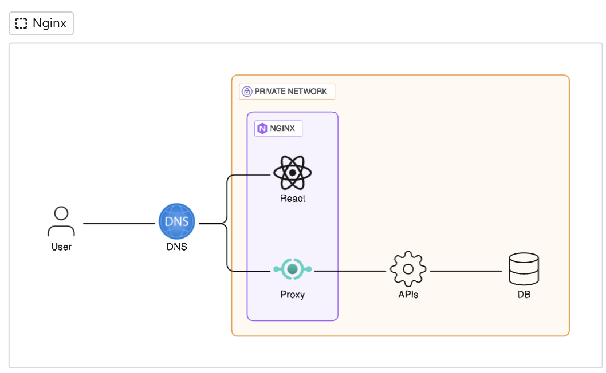
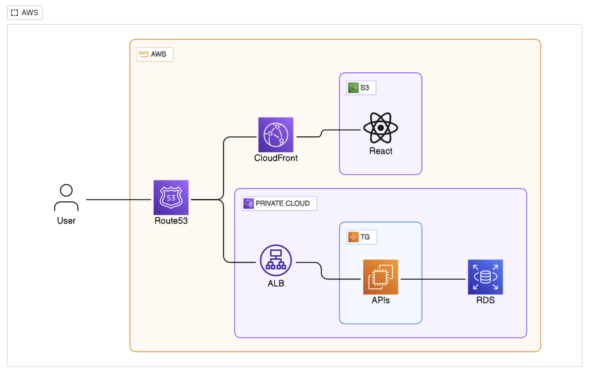
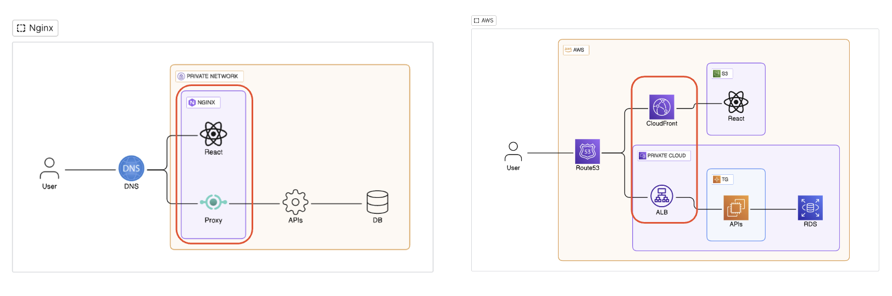

## 정리의 이유

Nginx 시리즈는 21년도 12월에 사이드 프로젝트를 위해 정리했던 내용을 토대로 작성한 글이다.  

요즘에는 AWS 프리티어 덕분에 Nginx를 직접 설치해서 사용하는 경우는 드물어 보인다.  
나 또한 사이드 프로젝트 이후 지난 2년간 현업에서도 개인적으로도 Nginx를 설치하여 사용한 적은 없었다.  

그렇다면 'Nginx 지식은 현재 중요하지 않을까?' 적어도 내겐 아니었다. 
현업에 들어가기 전, AWS 사용해 보기 전 Nginx를 사용해 본 경험은 내게 큰 시야를 가져다주었기 때문이다.  
그리고 지금부터 내가 얻은 큰 시야에 대해 얘기해 보려 한다.  

## 웹 서비스 인프라

웹 서비스를 제공하기 위한 인프라는 복잡하며, 회사에 따라 서비스에 따라 조금씩 다른 구조를 가진다.  
하지만 아무리 다르다고 하더라도 큰 골격은 비슷하다.  
1. 서비스 도메인을 관리하는 DNS 
2. 정적인 자원을 호스팅하는 '웹서버' 
3. API 같은 동적인 자원을 호스팅하는 'API 서버' (또는 'WAS')
4. 데이터를 저장하고 조회하기 위한 'DBMS' 

물론 작은 서비스나 초기 서비스의 경우 '웹서버'와 'API 서버'를 분리하지 않는 구조를 사용할 수 있다.  
이 경우를 제외한 웹서비스는 정적인 자원을 호스팅하는 서버와 동적인 자원을 호스팅 하는 서버로 나뉜다.  
 - 웹서버: 이미지, HTML, CSS, JS( CSR 라이브러리 코드 )같은 정적인 자원을 호스팅  
 - API 서버: DB의 데이터나 외부 API를 사용하여 동적인 데이터를 JSON 같은 형태로 호스팅  

Nginx는 이러한 인프라를 직관적이고 손쉽게 구성할 수 있도록 해준다.  
- 웹서버 기능 제공
- 프록시를 통한 API 서버와 통신 기능 제공
- 부하 분산 기능 제공

## Nginx VS AWS 인프라 설정 비교

먼저 Nginx는 AWS를 비교하는 것 자체가 오류라고 느껴질지 모른다.  
그럼에도 복잡한 AWS 기능을 단순화하여 Nginx와 비교한다면 AWS가 한결 쉽게 느껴질 수 있다고 생각한다.  

기본 인프라 요구 사항
1. https를 지원하는 도메인  
2. 클라이언트 사이드 코드인 'React'와 각종 정적인 지원을 호스팅 하는 웹서버  
3. N개의 API서버  
4. 부하 분산을 위한 로드벨런서(L7)  
5. 데이터를 저장하고 조회할 DB  

### Nginx 인프라  


(당연하게도) Nginx로 불가능한 인프라  
- 도메인 구매 및 설정, SSL 발급
- API 서버
- DB

#### Nginx 설정 파일 참고 

설정 파일에 따라 Nginx 이러한 역할을 수행한다.  
- http://domain.com 로 요청시 https://domain.com 로 리다이렉팅
	- 모든 트래픽이 Nginx로 오기 때문에 ssl 인증서를 한 곳에서 관리 할 수 있다.
- https://domain.com 의 루트(/)로 요청시 index.html(react) 응답
	- 웹서버의 역할을 수행한다.
- https://domain.com 의 /api로 요청시 `upstream api-server` 에 정의된 API 서버로 트래픽 전달
	- nginx의 `upstream` 은 L7 로드밸런서 역할을 수행할 수 있다.  
	- 트래픽은 기본적으로 '라운드 로빈' 방식을 사용하여 전달된다.  

```nginx
user  nginx;
worker_processes  1;
error_log  /var/log/nginx/error.log warn;
pid        /var/run/nginx.pid;
events {                     
    worker_connections  1024;
}
http {
    include       /etc/nginx/mime.types;        
    default_type  application/octet-stream;
    sendfile        on;                                                       
    keepalive_timeout  65;                                         
    
    # 1. 포워드할 upstream 프록시 서버 설정 - api 서버
    upstream api-server {
        server api-1:8080; # api-1: ip 주소 or 도커 서비스 이름
        server api-2:8080;
    }

    # 2. 가상 호스트 서버 - 1) http => https 리다이렉팅
    server {
      listen 80; 
      server_name domain.com;
      server_tokens off;

      location / {
        return 301 https://$host$request_uri;
      }
    }

    # 2. 가상 호스트 서버 - 2) openssl을 적용한 https 서버
    server {
        listen 443 ssl;
        listen [::]:443;
        server_name domain.com;

        server_tokens off;

        ## ssl 설정 - openssl 전용 ##
        ssl_certificate /etc/nginx/ssl/lesstif.com.crt;
        ssl_certificate_key /etc/nginx/ssl/lesstif.com.key;
        ssl_session_cache    shared:SSL:1m;
        ssl_session_timeout  5m;
        ssl_ciphers  HIGH:!aNULL:!MD5;
        ssl_prefer_server_ciphers  on;
     
        # 3. 기본 루트 설정 
        location / { 
          root /usr/share/nginx/html/;    # 호스팅할 build 파일 경로
          index index.html index.htm;
          try_files $uri $uri/ /index.html =404;
        }

        # 4. upstream 그룹을 호출하여 트래픽 전달
        location /api {
            proxy_pass         http://api-server; # api-server: upstream 이름
            proxy_redirect     off;
            proxy_set_header   Host $host;
            # ...Frowarded 헤더 설정 생략
            proxy_cache_bypass $http_upgrade;
            proxy_http_version 1.1;
        }
    }                      
}
```


### AWS 인프라



구성 설명
- `Route53`: AWS에서 제공하는 DNS 시스템이다.
	- 도메인 구매, 갱신, 이관 등 관리 기능을 제공한다.  
	- 보안관련 설정이 가능하다.
	- Route53을 사용하면 단일 End Point 역할을 수행하기 때문에 효과적인 트래픽 관리가 가능하다.
- `CloudFront`: CDN 이라 불리며 정적인 콘텐츠를 빠르게 제공하기 위한 구성이다.  
	- CloudFront에 인증서를 붙이기 때문에 사용하지 않는 경우 https를 사용할 수 없다.  
- `S3`: AWS에서 제공하는 정적 파일을 호스팅 하는 서버이다.  
- `ALB`
	- Application Load Balancer의 약자로 L7 로드 밸런서를 의미한다.  
	- ALB 또한 기본적으로 '라운드 로빈' 방법을 사용하여 트래픽을 전달한다.  
	- ALB에 인증서(ssl)를 붙기기 때문에 사용하지 않는 경우 API 서버는 https를 사용할 수 없다.  
- APIs: n개의 EC2
	- 도커같은 컨테이너 환경을 사용하지 않는다면 여러 EC2를 그룹화 하여 트래픽을 분산한다.  
	- ALB와 EC2를 연동하려면 필수적으로 Target Group가 필요하다.
	- Target Group은 n개의 ec2를 그룹화 한다.  


### 아키텍처 비교


#### Network
[Nginx]
- 어떤 도메인 이든 호스팅이 되어야 하기 때문에 편의상 Private Network 로 했다.

[AWS]
- AWS의 경우 aws 서비스를 사용하기 때문에 도면상 aws안에 모든 서비스가 들어가 있다.
#### DNS
여기서 DNS 시스템을 설명하기에는 무리가 있기 때문에 맥락만 설명한다.  
어떤 도메인이든 DNS 서버를 ip 주소가 클라이언트로 응답된다.  
DNS는 한개가 아니며 계층적 조회된다.   
AWS의 경우 자신들의 DNS 서비스를 Route53으로 칭할 뿐 결국 DNS 서비스이다.  

#### 웹서버 서버
[Nginx]
- Nginx의 기본적인 역할은 웹서버이다. 
- Nginx의 경우 ssl 인증서를 등록하는 설정만하면 https 통신이 가능하다.  

[AWS]
- AWS의 경우 S3만 사용하여 웹서버 역할을 수행할 수 있지만 S3만으로는 한계가 있다.
- 가장 중요한 지점은 S3만으로는 https 통신을 지원하지 않기 때문에 CloudFront(CDN)를 사용해야 한다.   
- CloudFront를 웹서버라고 말할 수는 없지만 '웹서버 역할도 수행한다.' 라고 말할 수는 있을 것 같다.  
- CloudFront를 url path 별 동작이나, 캐싱, 응답 body 압축 같은 웹서버의 기능을 기본으로 제공한다.  

#### 동적(API) 서버
Nginx와 AWS 가장 다른 구성은 '정적 자원은 CloudFront'를 '동적 자원은 ALB'를 사용하는 구성이다.  
CloudFront는 기본적으로 정적인 콘텐츠를 다양한 엣지 서버에서 빠르게 응답하는 서비스이다.   
때문에 CloudFront는 EC2와 직접적인 통신은 지원하지 않는다.    

[Nginx]
- Nginx의 경우 `upstream` 블록을 통해 API 서버들을 그룹화 한다.  
- 처리 순서는 아래와 같다.
	1. 특정 url 요청시 `upstream` 으로 그룹화된 API로 요청을 전달한다.
	2. 그룹내 API 서버중 한개로 요청을 전달한다. (라운드로빈 방식을 사용한다.)  
	3. 요청을 처리한 API 서버는 Nginx로 응답한다.  
	4. 마지막으로 Nginx는 클라이언트로 응답한다.  
- Nginx가 지원하는 기능인 프록시와 L7 로드밸런서 기능을 사용한 것이다.  
- 모든 요청이 Nginx를 통해 처리되면 다양한 이점을 누릴 수 있기 때문에 이러한 구성을 많이 사용한다.  
	- ssl 인증서 관리의 편의성
	- api 서버를 노출하지 않음
	- 부하분산으로 인한 다양한 이점(배포, 장애 ...)

[AWS]
- Route53에서 EC2로 트래픽을 전달할 수 있지만 이 경우도 한계가 있어 ALB와 같이 사용한다. 
- Route53과 ALB 연동은 sub-domain을 지정하여 수행하는 경우가 많다.  
- 처리 순서는 아래와 같다.
	- sub-domain(api.domain.com)으로 요청이 들어오면 ALB로 트래픽을 전달한다.
	- ALB는 Target Group으로 트래픽을 보낸다.  (라운드로빈 방식을 사용한다.)  
	- Target Group에 지정된 EC2중 하나의 서버로 요청이 전달된다.
	- 요청을 처리한 EC2 서버는 Target Group으로 요청을 응답한다.
	- Target Group은 요청을 ALB로 전달하여 유저에게 응답된다.  
- Nginx와 마찬가지로 요청이 단일 지점에서 처리되면 동일한 이점을 누릴 수 있다.

## 결론

위의 두 아키텍처 모두 22년 23년에 각각 사이드 프로젝트에서 사용한 구조이다.  
실제 현업에서는 서버리스'나 컨테이너 환경 기반의 'ECS', 'ECK' 등등의 기술이 추가된다.  
게다가 안전성(내결함성 고가용성)과 보안상의 이유로 더욱 복잡한 구조를 가진다. 

신입 그리고 주니어에게 AWS는 꽤나 무섭게 느껴진다.  적어도 나는 그랬다.   
AWS 자체가 너무 거대한 산처럼 느껴지고 과금이 무서웠기 때문에 22년 초 사이드 프로젝트에서는 온프레미스 환경에서 프로젝트를 진행하였다. (iptime의 ddns 설정, 우분투 설치 등 삽질의 여정이었다.)

그 후 주니어로 회사를 다니며 AWS와 친해졌다. 이때 내가 했던 Nginx와 사투의 경험이 도움이 되었다.  
결과적으로 23년 현재 팀 사이드 프로젝트에서 메인으로 인프라를 구성하여 운영할 수 있을 정도로 성장하였다.  
때문에 내 삽질의 기록이 누군가에게 도움이 되기를 바라며 이번 시리즈를 정리한다.  