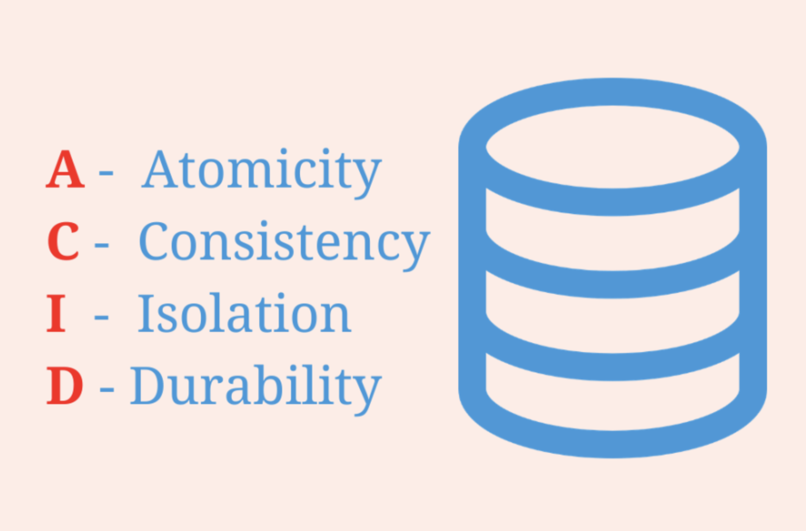

## ACID이란?

ACID는 트랜잭션이 제공해야하는 4가지 윈칙을 의미한다.  
트랜잭션에서 제공하는 안정성을 말할 때 흔히 ACID를 설명한다. 

ACID는 1983년 데이터베이스의 내결함성 메커니즘을 나타내는 정확한 용어를 확립하기 위해 만들었다.
- A - 원자성(Atomicity)
- C - 일관성(Consistency)
-  I - 격리성(Isolation)
- D - 지속성(Durability)

하지만 데이터베이스마다 ACID 구현은 제각각이다.  
때문에  데이터베이스에서 말하는 "ACID를 준수"한다는 말은 정확하게 어떤 것을 준수하고 있는지 명확하지 않는 경우가 많다고 한다.
## 원자성(Atomicity)
일반적인 의미로 원자성이란 더 작은 부분으로 쪼갤 수 없는 뭔가를 말한다.   
그리고 이 단어는 컴퓨터에서 비슷하지만 미묘하게 다르게 의미하는 경우가 많다.  

멀티 스레드 프로그래밍에서의 원자적 연산은 동시성과 관련된다.  
- 한 스레드에서 진행중인 연산은 다른 스레드에서 관찰할 수 없다.
- 즉, 시스템에서 연산을 실행하기 전이나 실행한 후의 상태만 있을 수 있으며 그 중간 상태로는 머물 수 없다.

반면 ACID의 맥락에서 원자성은 동시성과 관련이 없다.  
트랜잭션에서 원자성을 설명할 때 여러 프로세스에서 동시에 같은 데이터에 접근하려고 할 때 무슨일이 발생하는지 설명하지 않는다.  
(이 문제는 격리성에서 다룬다.)  

대신 ACID의 원자성에서는 트랜잭션에서 쓰기 작업 몇 개를 실행하려고 하는데 그 중 일부만 처리되고 결함이나 장애가 발생하는 경우에 대해 설명한다. 여러 작업이 하나의 원자적인 트랜잭션으로 묶여 있는데 결함으로 완료(commit)할 수 없다면 실패(abort)되고 데이터베이스는 해당 트랜잭션이 지금까지 실행한 쓰기를 무시하거나 취소해야 한다.  

트랜잭션에서 원자성은 "어보트 능력"이라고 말할 수 있다.  
오류가 생겼을 때 트랜잭션을 abort하고 해당 트랜잭션에서 수행된 모든 작업을 취소하는 능력이다.  
## 일관성(Consistency)
데이터의 일관성은 애플리케이션에 의존한다. (책에서는 일관성은 DB의 영역이 아닌 애플리케이션의 영역이라고 말한다.)  
데이터베이스의 경우 제약조건이나 스키마로 어느 정도의 일관성은 보장할 수 있지만 기본적으로 데이터의 저장을 책임진다.  
데이터가 유효한지 아닌지 판단하는 것은 애플리케이션의 책임이다.  
때문에 ACID에서 일관성은 DB의 속성이기 보단 애플리케이션의 속성에 가깝다. 
## 격리성(Isolation)
대부분 데이터베이스는 여러 클라이언트에서 접속한다. 여러 클라이언트에서 같은 레코드에 접근하면 동시성 문제가 발생한다.  
ACID에서 말하는 격리성은 동시에 실행된 트랜잭션이 서로 격리되어 레코드에 접근하는 것을 말한다.

격리성은 어떻게 구현될까?  
고전적인 데이터베이스에서는 직렬성 격리(Serializable Isolation)를 사용하는 것을 공식화 한다.  
직렬성은 각 트랜잭션이 전체 데이터베이스에서 실행되는 유일한 트랜잭션인 것처럼 동작하는 것을 말하며,  
데이터베이스는 여러 트랜잭션을 순차적으로 실행하여 직렬성 격리를 보장한다. 

그러나 직렬성 격리는 심각한 성능 손해를 동반하기 때문에 현실에서 사용되는 경우는 매우 드물다.  
오라클 11g 처럼 직렬성 격리를 아예 구현조차 하지 않은 경우도 있다. (오라클에 "직렬성" 격리는 스냅숏 격리로 이루어진다.)

이외 격리성은 보통 데이터베이스마다 격리 레벨을 통해 다양한 방법으로 구현되어 관리된다.
구현에는 락을 이용하거나, 스냅샷 같은 방법을 사용한다.
## 지속성(Durability)
데이터베이스 시스템의 주목적은 데이터를 안전하게 저장하는 것이다.  
때문에 ACID에서 지속성은 트랜잭션이 성공적으로 "커밋"되었다면 하드웨어 결함이 발생하거나 데이터베이스가 죽더라도 트랜잭션에서 기록된 모든 데이터는 손실되지 않고 보장되는 것을 의미한다.

일반적으로 단일 노드를 사용하는 데이터베이스에서 지속성은 데이터가 디스크(SSD, HDD)같은 비 휘발성 저장소에 기록됐다는 뜻이다. 또한 보통은 디스크에 저장된 데이터 구조가 오염됐을 때 복구할 수 있게 해주는 쓰기 전 로그(write ahead log)같은 수단을 지원한다.

다중으로 복제된 데이터베이스의 경우 지속성은 데이터가 성공적으로 다른 노드에 복사됐다는 의미이기도 하다.
이때 지속성을 보장하려면 데이터베이스는 트랜잭션이 성공적으로 커밋됐다고 보고하기 전에 복제가 완료되기를 기다려야 한다.
### 복제와 지속성에 대한 추가적인 인사이드
데이터의 지속성은 과거와 현재 조금 다른 방법으로 구현된다.
- 과거: 지속성은 아카이브 테이브(자기테이프)에 기록을 의미한다.
- 최근: 지속성은 복제를 의미한다.

어떤 방법이 더 좋다라고 말할 수는 없다 두 방법 모두 한계가 있기 때문이다.
- 데이터를 기록하는 방법의 경우 장비가 죽는 경우 해당 장비를 복구하지 않는다면 데이터에 접근 할 수 없다. 반면 복제를 해두었다면 복제된 데이터를 통해 데이터에 접근 할 수 있다.
- 비동기식으로 복제되는 시스템의 경우 쓰기를 담당하는 리더에 장애가 발생하는 경우 최근에 쓴 데이터가 손실 될 수 있다.

지속성을 위협하는 다양한 사례
- fsync(파일쓰기명령)에 버그가 있는 경우 디스크의 펌웨어에 버그가 있는 경우
- 저장 엔진과 파일시스템 상호작용 과정에서 버그가 있는 경우
- SSD, HDD 모두 시간에 지나면 배드 블록이 생기는 문제
- SSD에 갑자기 전원 나가면 손실이 발생할 수 있는 문제
- SSD에 전원 연결이 끊어지면 온도에 따라서 몇 주 내에 데이터 손실이 발생 할 수 있는 문제

결론
지속성을 보장하는 절대적인 한가지 기법은 없다. 디스크에 쓰기, 원격지에 복사, 백업 등을 포함하여 위험을 줄이려는 다양한 기법이 있을 뿐이다. 하나만 사용하는 것이 아닌 여러 기법을 함께 사용하여 지속성을 보장하려 노력해야한다.  
즉, 지속성 보장은 이론적인 것이며, 지속성을 보장하기 위해 노력해야한다.

## 참고
- [데이터 중심 애플리케이션 설계](https://www.yes24.com/Product/Goods/59566585) 7장. 트랜잭션