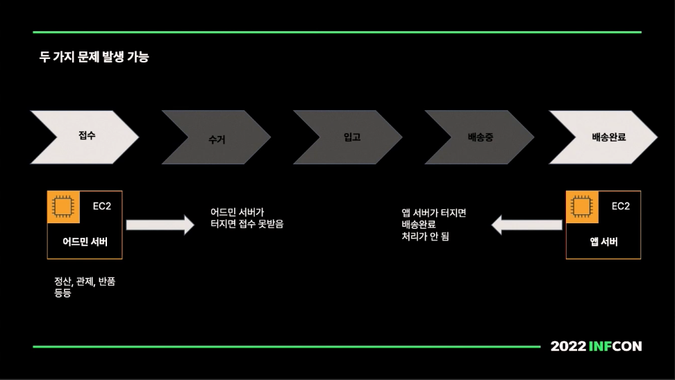
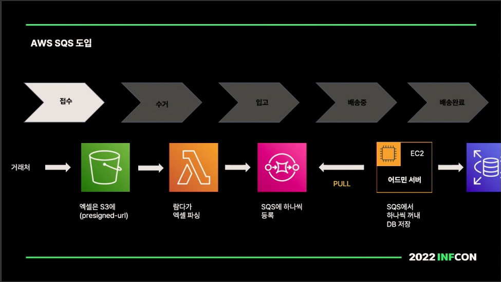

# 들어가기 전에

---

컨퍼런스 글 정리 1편은 제로초로 더 잘 알려진 조현영님의 발표로 정리하였다.
많은 컨퍼런스 주제중  서버비 0원이라는 제목 때문에 이 발표 내용을 먼저 정리하게 되었다.

인프콘을 보게 된 시점은 입사 후 첫 메인 프로젝트를 무사히 끝낸 시기였다.

JAVA Spring를 먼저 배우고 Nodejs의 express를 지나 Nestjs에 정착하고 취업을 하였다.

취업 후 4개월 차에 회사 메인 프로덕트에 사용할 상품, 주문 API 서버를 개발하는 매인 담당이 되었다.

두 달 조금 넘는 개발 기간 동안 내가 알고 있는 최선의 방법으로 연약하지만 나름 돌아가는 API 서버를 배포하였을 무렵 나는 나는 서버 설계와 작성 방법에 많은 문제점을 느끼게 되었다.

- JS 답지 못한 코드 설계
- MVC 패턴의 한계
- 비즈니스적 문제를 코드로만 해결하려는 문제
- 좋은 툴과 인프라를 활용(생각도) 하지 못하는 문제

위의 내용 말고도 수많은 의문과 문제의 갈고리가 쌓여 갈 때쯤 인프콘을 보고 살짝 얻어맞은 느낌을 받았다.
모든 의문과 문제를 해결할 수는 없겠지만 더 나은 해결 방법을 생각하게 해준 발표였기 때문에 정리하려 한다.

# 발표내용 정리

---

## 1. 문제가 발생한 엑셀업로드 로직

접수 로직에서 다량의 엑셀 업로드를 받는 경우 메모리 초과로 서버가 죽는 현상이 발생한다.
서버가 죽는 경우 이후에 모든 로직이 블락되는 큰 장애를 야기한다.

## 2. 발표에서 말하는 문제 상황

- 엑셀 업로드에서 서버의 한계를 초과하는 요청이 들어오게 되면 서버가 죽는 현상
- 비즈니스 특성상 장애가 발생하면 1시간 안에 해결해야 하는 상황
- 거래처에서 사용하기 때문에 다량의 엑셀업로드가 되는 시간을 통제할 수 없는 환경
- 서버비 문제로 스케일업을 항상 할 수 없는 재정적 문제
- 스케일 아웃이 되는 시간보다 서버의 메모리가 100프로가 넘어가는 시간이 빨라서 스케일 아웃도 사용하지 못하는 상황

## 3. 문제 해결을 위해 필요한 요구 사항

- 나는 나를 믿을 수 없다(CTO).
    
    ⇒ 그럼 누구를 믿을 수 있나?
    
- 돈도 없다.
    
    ⇒ 돈이 들지 않는게 있나?
    
- 메모리가 초과되지 않도록 누가 중간에서 천천히 보내줬으면 좋겠다.
    
    ⇒ 중간에서 천천히 보내줄 수 있는게 있나.
    

요구 사항에 부합하는 결론 **클라우드 큐( AWS SQS )**

## 4. **AWS SQS를 사용한 엑셀 업로드**

1. 업로드된 엑셀 파일을 S3에 저장한다.
2. S3에 엑셀 파일이 생성되면 람다가 해당 엑셀 파일을 JSON으로 파싱한다.
3. 파일된 JSON을 AWS SQS로 보낸다. 
4. 어드민 서버는 SQS에 올라간 JSON 파일을 단 건 또는 서버가 감당할 수 있는 많큼 PULL하여 처리한다.

## 5. 비즈니스적으로 부가적인 장점

- 기존 방법에서 엑셀업로드 로직에서 장애가 발생하면 거래처의 담당자가 엑셀을 다시 업로드 해야했다.
- 변경된 방법의 경우 S3에 엑셀 파일이 올라가기 때문에 처리중 장애가 발생하여도 다시 처리가 가능하다.

## 6. 서버비 0원이라고 말하는 이유

# 발표 보고 정리된 생각

---

발표를 보기 전과 본 후 가장 큰 생각의 전환은 API 서버 안에서 코드로 모든 문제를 해결하려고만 하지 말고 외부의 좋은 환경과 툴을 적절하게 사용하는 것을 고려해 보자는 것이다.

조금 더 자세하게 설명한다면 

이번 프로젝트를 진행하면서 나의 설계 관점은 유저의 API는 최대한 가볍게 어드민의 API는 무겁더라도 나중에 개선하자는 방향이였다. 결과적으로 유저 API의 퍼포먼스는 가시적으로 보일 많큼 빠르게 동작하였다. 
하지만 어드민 API는 생각보다 더 무거웠고 오픈 직전에는 힙 메모리가 터지는 상황까지 발생하여 급하게 API를 쪼개고 로직을 보수하는 작업까지 진행하게 되었었다.

그래서 발표를 보았을 때 살짝 얻어 맞는 느낌이 들었다.
내가 저 방법을 생각해서 무거운 로직을 람다로 처리하거나 큐, 이벤트등으로 조금 더 유연하게 처리 했었다면 조금더 나은 코드가 되지 않았을까 복기를 하는 계기되 되었다. 

## 발표를 통해 나의 문제 상황 해결 방법

### JS 답지 못한 코드 설계

ORM을 사용했음에도 특정 로직은 트랜잭션안에서 많은 SQL 처리가 필요했다. 
그리고 모든 SQL로직은 async await를 사용하여 처리했다.

예시로 옵션에 따라 상품을 만드는 로직의 경우 비즈니스 특성상 몇 백개의 상품이 나오기도 하는데 이러한 로직은 서버에 많은 부하를 발생시킨다. 그래서 무거운 로직은 람다로 처리하는 방향을 생각중이다.

### 비즈니스적 문제를 코드로만 해결하려는 문제

API 개발을 하면서 항상 느끼지만 너무 많은 것을 코드에서 처리하려 하는 경향이 있는 것 같다 그렇기 때문에 하나의 비즈니스 로직이 너무 비대해지고 분해하기 어려워지는 문제에 종종 마주한다. 

그럴 때마다 코드를 수정하고 쪼개는 과정에서 많은 시간을 들여 야근이나 기한을 맞추지 못하는 경우가 많았다.
그러한 방향성이 기본적으로 맞을 수는 있지만 비대해진 로직을 다른 방향으로 처리하는 것도 고려하고 학습해 볼 필요성을 느꼈다. 

### 좋은 툴과 인프라를 활용(생각도) 하지 못하는 문제

AWS 같은 클라우드에서 제공하는 인프라를 활용하는 방법이 은탄환은 아니라는 것은 알고 있다.

하지만 선택지에 없는 것과 알고서 고려하는 것은 다르기 때문에 이것에 대한 충분한 테스트와 학습을 통해 프로젝트에 적용해 보려한다.

# 출처
출처: [https://www.inflearn.com/course/infcon2022/unit/126522](https://www.inflearn.com/course/infcon2022/unit/126522)