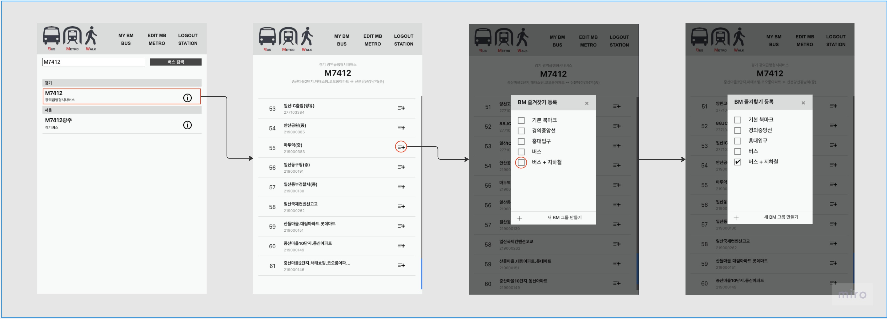
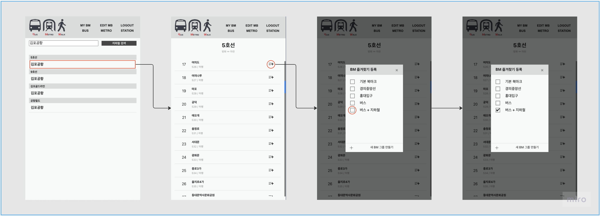
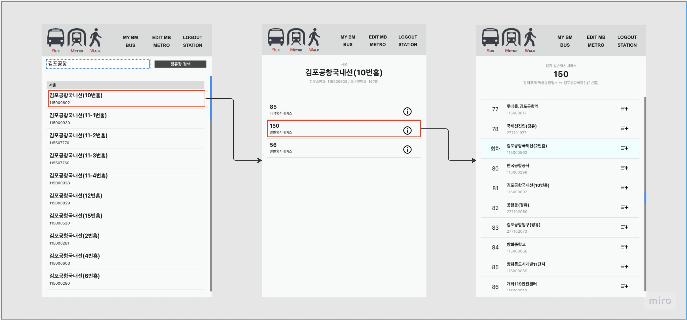
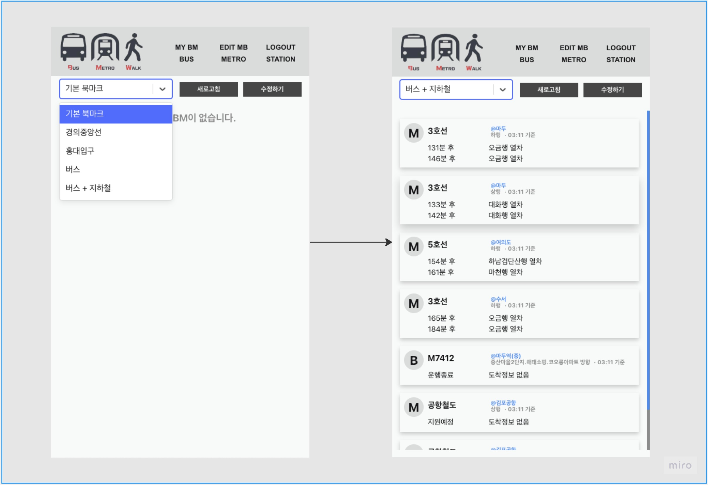
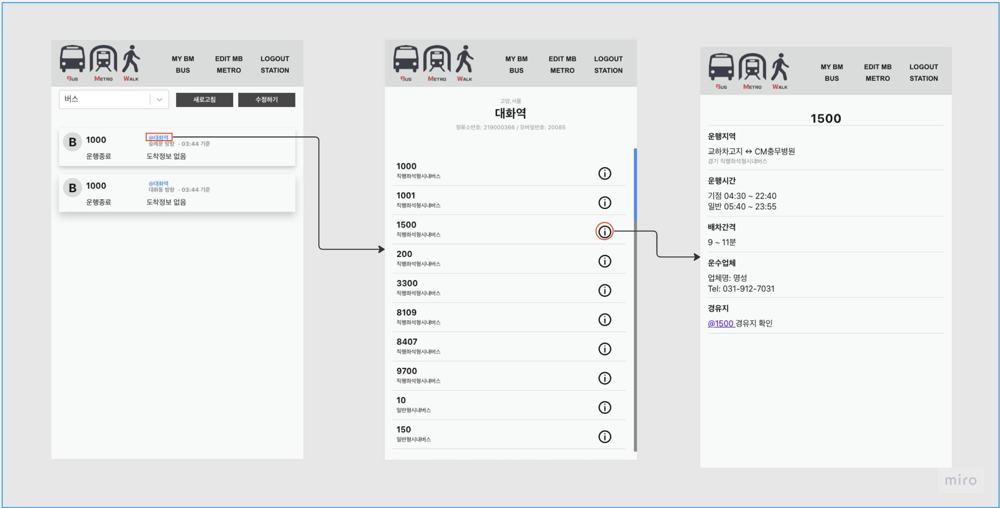
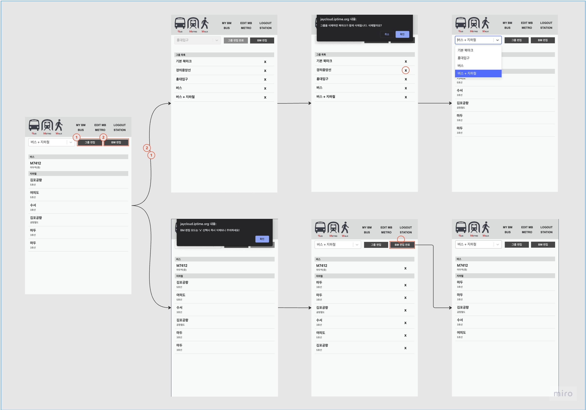

## 프로젝트 소개

프로젝트 BMW는 Bus Metro Walk의 첫자를 합친 이름입니다.
버스, 지하철을 사용하는 뚜벅이를 위한 심플한 대중교통 정보를 제공하는 프로젝트입니다.  

### 만들게 된 이유

이왕이면 내가 사용하고 싶은 서비스를 만들고 싶었습니다.  
제가 사는 곳은 지하철과 버스정류장 거리가 조금 있습니다.  
때문에 지하철과 버스를 도착정보를 둘 다 확인해야 하는 경우가 꽤 많이 발생합니다.

일반적으로 버스, 지하철 도착정보를 확인하는 방법은 2가지가 있습니다.
1. 지하철 앱으로 확인 + 버스 앱으로 확인 
2. 지도 앱에서 지하철 도착정보 확인 + 버스 도착정보 확인

두 방법을 모두 사용해 봤지만 단점이 있었습니다.  
- 1번의 경우는 두 가지 앱에서 따로 확인해야 하는 번거로움이 있습니다.  
- 2번의 경우 두 손을 모두 사용하지 못하는 상황에서 지도 확대가 힘들어 정확한 터치를 못하는 경우가 많았습니다.  

이러한 불편함을 해소하기 위해 여러 앱을 사용해 봤고, 제게 가장 편한 UI는 '카카오버스' 앱이었습니다.  
결과적으로 '카카오버스' 같은 UI에 지하철 정보를 추가적으로 제공하는 앱을 만들기로 하였습니다.  

## 주요 기능 소개

### 1. 버스 즐겨찾기에 등록

### 2. 지하철 역 즐겨찾기에 등록

### 3. 정류소에 정차 하는 버스 찾기

### 4. 즐겨찾기(버스 지하철) 도착정보 조회

### 5. 버스 노선 정보 제공

### 6. 즐겨찾기 관리

