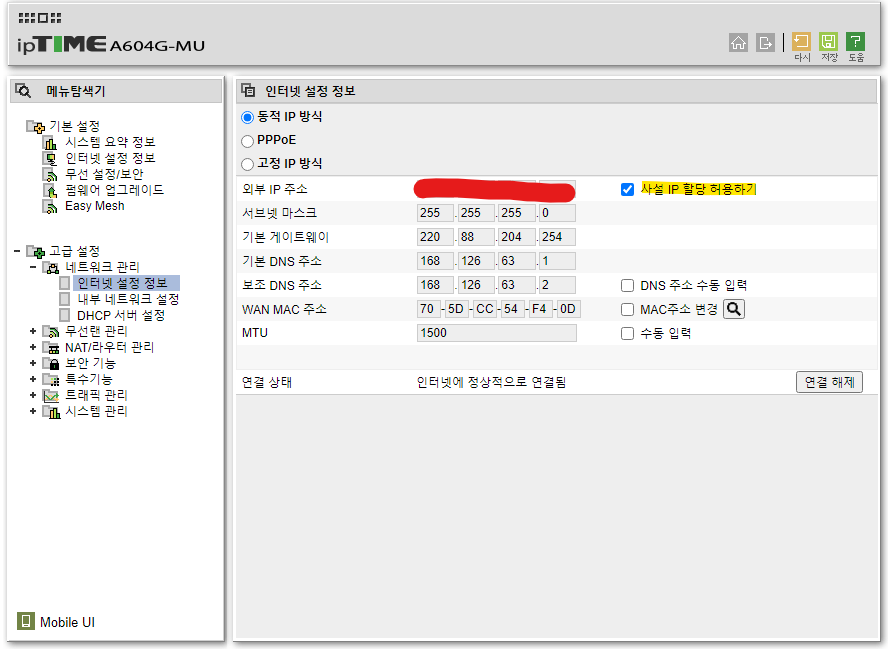
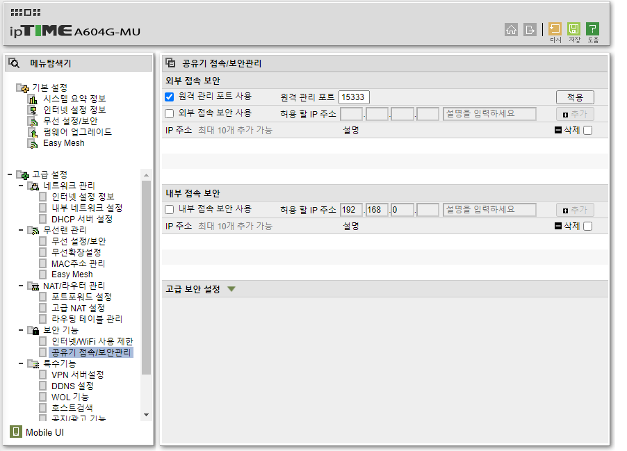
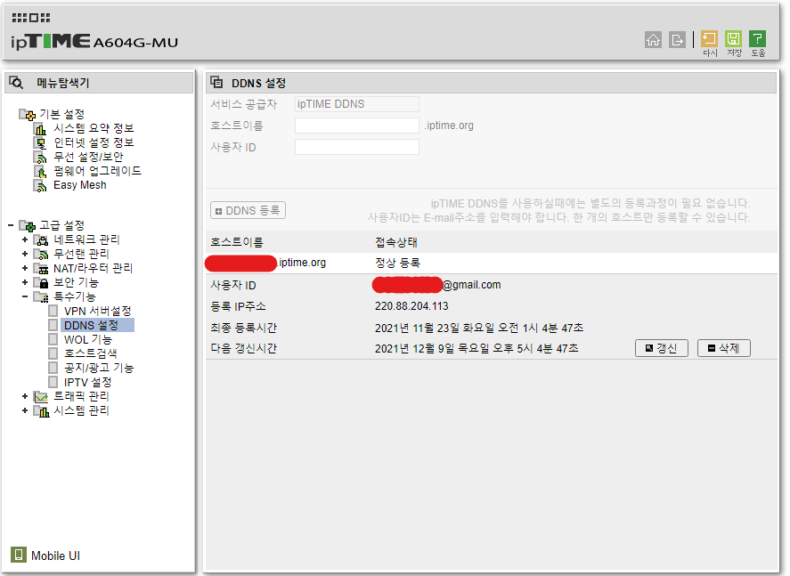
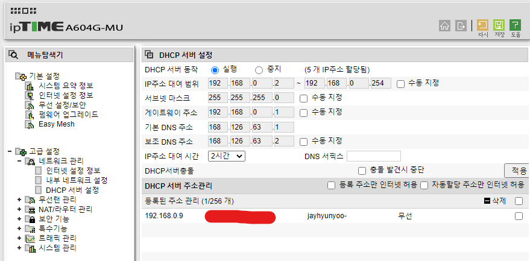

## 우분투 설치 및 초기 설정

1. 우분투 설치
	- [우분투 부팅 디스크 만들기어 설치](https://heisanbug.tistory.com/17)
	- [GUI 모드에서 CLI 버전으로 설정하기](https://booiljung.github.io/technical_articles/linux/switch_gui_and_cli.html)
	- apt & apt-get 최신화
2. 우분투 보안 설정
	- [SSH 접속 설정](https://blog.lael.be/post/7678): SSH 원격접속 허용, root 계정 비밀번호 설정, SSH 비밀번호 로그인 금지
	- [UFW로 방화벽 설정](https://happist.com/561474/%EC%9A%B0%EB%B6%84%ED%88%AC-18-04%EB%A1%9C-%EC%84%9C%EB%B2%84-%EC%9A%B4%EC%98%81-ufw%EB%A1%9C-%EB%B0%A9%ED%99%94%EB%B2%BD-%EC%84%A4%EC%A0%95#26_jeobsog_poteuleul_bulheohaneun_gyeong-u): 22포트(SSH) 허용 & 사용할 포트 허용


## 우분투에 도커 설치

내가 사용한 우분투에 도커 설치 방법은 apt에 외부 저장소를 등록하여 도커를 설치하는 방법을 사용했다.  
이러한 방법이 생소하여 조금 헤맸기 때문에 간단하게 설명한다.  

리눅스는 다양한 패키지 관리 도구가 있다.
그 중 apt의 경우 데비안 계열의 패키지를 관리하는데 쓰이는 도구이다.
(쉽게 설명하면 node의 npm, python의 pip 같은 도구이다.)

apt도 npm의 package.json 처럼 정의된 문서(`/etc/apt/trusted.gpg`)가 존재한다.  
그리고 `apt update`는 `npm update` 처럼 설치된 패키지를 최신화하는 명령이다.

또한 apt에는 `apt-key add` 같은 명령이 존재한다.  
간단하게 설명하면 설치할 패키지의 URL을 `trusted.gpg`에 등록하는 작업이다.
URL로 따로 등록하는 기능을 둔 이유는 너무 많은 패키지를 미리 등록하는데 한계가 있기 때문이라고 하며,  
`apt-key add`로 등록 가능하려면 `gpg` 암호화를 사용하는 신뢰할 수 있는 소스 코드만 가능하다.
(아래 설명할 docker 설치에서 이 방법을 사용한다.)

### 1. apt 업데이트
`$ sudo apt update`

### 2. apt를 사용해 유틸 설치
```bash
$ sudo apt install apt-transport-https
$ sudo apt install ca-certificates
$ sudo apt install curl
$ sudo apt install software-properties-common
```

### 3. 도커 설치
#### 3.1. apt-key 패키지 리스트에 저장할 저장소의 키(gpg)를 등록한다.

```bash
$ curl -fsSL <https://download.docker.com/linux/ubuntu/gpg> | sudo apt-key add -
```

1. curl을 통해 gpg 키를 다운 받는다.
2. apt-key 리스트에 저장한다.
3. `sudo apt-key list` 명령으로 확인이 가능하다.
4. `sudo gpg --list-packets /etc/apt/trusted.gpg`로 도 확인이 가능하다.

**Q) gpg란?**  
A) `gpg`는 메시지나 파일을 암호화 하여 전송하는 도구이며, RSA 암호를 사용한다.

**Q) apt-key 리스트란?**  
A) `apt-key`는 apt가 패키지를 인증하는 데 사용하는 키 목록을 관리하는 패키지이다.
	- 키를 사용하여 인증된 패키지는 신뢰할 수 있는 것으로 간주된다.

**Q) apt-key 사용 이유**
A) 리눅스의 경우 apt를 사용하여 다른 저장소의 파일을 로컬에 다운받는다.
이 때 아무 파일이나 설치하게 되면 위험할 수 있다.
이러한 이유로 안전한 파일 설치 또는 변조를 막기 위해 암호화를 수행하여 설치한다.

**Q) curl -fsSL 옵션이란?**  
```text
f : HTTP 요청 헤더의 contentType을 multipart/form-data로 보낸다.
s : 진행 과정이나 에러 정보를 보여주지 않는다.(–silent)
S : SSL 인증과 관련
L : 서버에서 301, 302 응답이 오면 redirection URL로 따라간다.
```

#### 3.2. apt 패키지 저장소 리스트에 다운받을 저장소 경로(url)를 등록한다.

`$ sudo add-apt-repository "deb [arch=amd64] <https://download.docker.com/linux/ubuntu> bionic stable"`

- `deb`: Debian 패키지를 사용하는 저장소를 의미한다.
- `[arch=amd64]`:  amd64 아키텍처를 사용하겠다는 의미이다.
- `bionic`: Ubuntu 버전의 코드이며, 여기서는 Ubuntu 18.04 LTS (Bionic Beaver) 버전을 의미한다.
- `stable`: 안정 버전의 소프트웨어를 제공하는 저장소 선택한다는 의미이다.

#### 3.3. apt 패키지 저장소 리스트 업데이트

`$ sudo apt update`

- 위에서 추가된 저장소 경로를 사용하여, 저장소 리스트 최신화 한다.

#### 3.4. apt-cache로 패키지 검색 (optional)

`$ apt-cache policy docker-ce`

- 설치 가능한 패키지 있는지 검색하여 확인한다.

#### 3.5. 패키지 설치

`$ sudo apt install docker-ce`

- 도커는 설치와 동시에 리눅스 시스템 서비스에 적용된다.
- 리눅스 시스템 서비스에 등록되면 부팅시 자동 실행되기 때문에 데몬 등록 필요가 없다.

#### 3.6. 시스템 서비스에 실행중인 도커 서비스 상태 확인

`$ sudo systemctl status docker`

#### 3.7 docker-compose 설치

curl로 설치
```bash
$ sudo curl -L "https://github.com/docker/compose/releases/download/1.29.2/docker-compose-$(uname -s)-$(uname -m)" -o /usr/local/bin/docker-compose
```
- 1.29.2 버전 설치

실행 권한 부여
```bash
$ sudo chmod +x /usr/local/bin/docker-compose
```

심볼릭 링크 설정 (optional)
```bash
$ sudo ln -s /usr/local/bin/docker-compose /usr/bin/docker-compose
```
- `/usr/bin/docker-compose` 로 접근할 수 있도록 설정

버전확인
```bash
$ docker-compose --version
```

#### 3.7. 명령어 정리

```bash
# docker 설치
$ curl -fsSL <https://download.docker.com/linux/ubuntu/gpg> | sudo apt-key add -
$ sudo add-apt-repository "deb [arch=amd64] <https://download.docker.com/linux/ubuntu> bionic stable"  # bionic 버전 확인
$ sudo apt update
$ apt-cache policy docker-ce
$ sudo apt install docker-ce
$ sudo systemctl status docker 

# docker-compose 설치
$ sudo curl -L "https://github.com/docker/compose/releases/download/1.29.2/docker-compose-$(uname -s)-$(uname -m)" -o /usr/local/bin/docker-compose
$ sudo chmod +x /usr/local/bin/docker-compose
$ docker-compose --version

```


## iptime(공유기)를 사용한 외부 접속 설정 (with DDNS)

### 1. 네트워크 관리/인터넷 설정 정보


⇒ 사설 ip 할당 허용하기 체크!

### 2. 보안기능/공유기 접속&보안관리 


⇒ 외부 접속 보안에 원격 관리 포트 사용 체크, 포트 입력

### 3. 특수기능/DDNS 설정 


⇒ DDNS 등록

### 4. 네트워크 관리/DHCP 서버 설정 


⇒ DHCP 서버 주소관리 탭에 주소 등록

### 5. NAT&라우터 관리/포트포워드 설정


⇒ 포트포워드는 보안을 위해 다른 포트로 지정하는게 안전하다.
ex) 12222포트를 22번으로 포트포워딩. 
- `ssh -i <key> -p 12222 ubuntu@<ip>`


여기까지 설정되었다면 DDNS로 등록된 주소로 접근이 가능해진다.
ex) test.iptime.org 도메인으로 등록했다면?
- `$ ssh -i <key> -p 12222 jayhyunyoo@test.iptime.org`