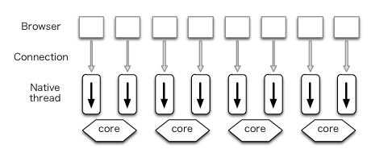
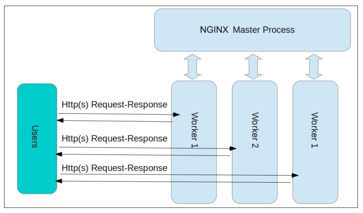

#개발지식 

## 연결문서
- [index-Nginx](../index-Nginx.md)

## 1. Nginx vs Apache

### Apache 서버의 구조적 한계

Apache 서버의 구조를 **MPM(Multi-Process Module) 방식**이라 한다.  

Apache와 같은 전통적인 웹서버는 클라이언트로 부터 받은 요청이 들어오면 요청 하나당 하나의 프로세스 또는 스레드(이하 "스레드")를 생성하여 처리한다. 요청마다 스레드가 생성되는 구조는 안정적인 구조와 높은 확장성이라는 장점을 가진다.

하지만 요청마다 스레드를 만드는 구조 한계가 있다.  
요청이 많으면 그 요청 만큼 스레드를 생성하여 요청을 처리한다.  
때문에 서버의 CPU와 메모리 자원의 소모가 커지는 단점을 가진다.  
(실제로 Apache 서버에는 **1만명의 접속자가 넘어가면 발생하는 성능저하 C10k 문제**가 있다.)

추가로 웹은 효율적인 커넥션 관리를 위해 Keep-Alive라는 헤더를 사용한다.  
(이 헤더를 가진 요청은 응답과 함께 바로 해지 되지 않고 Keep-Alive에 넣어진 값 만큼 연결을 유지한다.)

문제는 Apache 서버의 요청당 하나의 프로세스를 생성하는 특성에 Keep-Alive 헤더로 인해 연결이 유지되게 되면 유지된 시간동안 생성된 스레드가 놀고 있는 현상이 발생한다.

이 외에도 요청을 처리하는 과정에 I/O가 있다면, I/O 시간동안 스레드가 놀고 있는 현상이 발생한다.  

### Nginx 서버의 등장

Nginx는 Apache서버의 한계를 보안하기 위해 속도를 최적화 시키려는 노력에서 탄생한 웹서버이다.  
(또한 Apache의 C10K의 문제점을 해결하기 위해 만들어진 Event-Driven 구조의 웹 서버이다.)  

## 2. Nginx의 구조

Nginx는 하나의 **Master Process**와 다수의 **Worker Process**로 구성되어 실행된다.  

### Master Process

Master Process는 Nginx 구동시 환경 설정 파일을 읽고, 유효성 검사를 한다.  
그리고 **설정에 맞게 Worker Process를 생성 관리하는 역할을 한다.**

### Worker Process

**Nginx 웹 서버에 들어오는 모든 요청은 Worker Process에서 처리한다.**  
Nginx는 이벤트 기반(Event-Driven) 모델을 사용하고, Worker Process 사이에 요청을 효율적으로 분배하기 위해 OS에 의존적인 메커니즘을 사용한다.  

Worker Process는 환경 설정 파일에 정의된 개수만큼 Master Process에 의해 생성된다.  
(보통 Worker Process 개수는 사용 가능한 CPU 코어 숫자에 맞게 생성해 사용한다.)

**Worker Process는 여러개 일 수 있으며, Worker Process 당 하나의 프로세스로 동작한다.**

### Nginx 구조를 통한 로직 설명

1. Nginx는 구동시 Master Process를 만들어 환경 설정 파일을 읽고 유효성 검사를 한다. 그리고 유효성 검사를 통과하면 설정에 맞게 Worker Process를 생성한다.

2. Worker Process는 생성될때 각자 지정된 listen 소켓을 배정받는다. 그리고 지정된 소켓에 클라이언트로 부터 새로운 요청이 들어오면 커넥션을 형성하고 요청을 처리한다.  
	
Q) Keep-Alive 헤더가 사용한다면?   
A) Nginx는 응답 이후 커넥션이 Keep-Alive의 값 만큼 유지되어도 낭비가 없다.  
연결된 커넥션을 처리하는 Master Process에 추가적인 요청이 없다면 새로운 커넥션을 만들어 다음 요청을 처리하거나, 이미 만들어진 다른 커넥션으로부터 들어온 요청을 처리한다.

Worker Process에서 이러한 동작이 가능한 이유는 Event-Driven을 사용하기 때문이다.  
그래서 Nginx에서는 [ **커넥션 형성, 커넥션 제거, 새로운 요청** ]을 처리하는 것을 **이벤트라 부른다**.

이러한 이벤트들은 OS 커널이 큐안에 넣어 Worker Process에게 전달해준다.  
큐에 들어있는 이벤트들은 Worker Process가 이전 이벤트를 처리할 때까지 큐에서 대기한다.

즉, Worker Process는 Event-Driven을 사용한 비동기 방식 덕분에 놀고있는 스레드가 발생하지 않는다.  
덕분에 Apache 서버와 다르게 서버 자원을 훨씬 효율적으로 사용할 수 있다.  
( Event-Driven 방식을 사용하는 Nodejs와 동작과 특성이 비슷하다.)  

Q) Worker Process I/O 작업이 있는 요청이 들어온다면
A) Nginx는 오래걸리는 요청을 담당하는 Thread Pool을 미리 만들어 둔다.  
그래서 Worker Porcess가 처리할 요청이 오래 걸리는 작업이라면 만들어둔 Thread Pool에 작업을 위임하고,
큐에서 다음 이벤트를 꺼내어 처리한다.  
이후 Thread Pool에서 작업이 끝나면 완료된 결과를 다시 받아 응답한다.  

## 참고
- [[10분 테코톡] 🤫 피케이의 Nginx](https://www.youtube.com/watch?v=6FAwAXXj5N0)
- [[Nginx] Nginx 이해하기](https://icarus8050.tistory.com/57)
- [[TIL] 21/05/25 Nginx의 특징 및 Apache와의 비교](https://ariels1996.github.io/til/til22/)