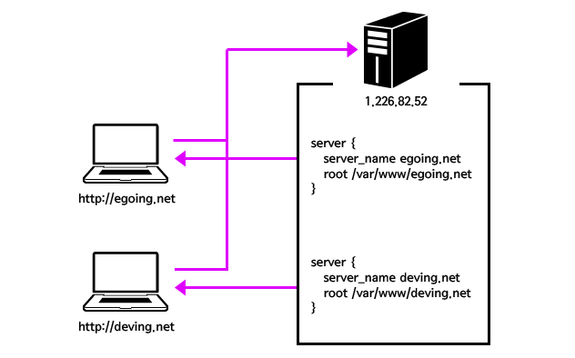

#개발지식 

## 연결문서
- [index-Nginx](../index-Nginx.md)

## 1. Nginx의 설정 파일

Nginx는 환경 설정 파일로 여러 가지 값을 지정해 Nginx가 실행할 수 있도록 지원한다.  
설정 파일은 논리적을 작성된 지시문 목록이며, 독립된 규칙을 가진다.  
또한 Nginx에는 다양한 모듈이 존재하고 설정파일의 지시문에 따라 내부에 정의된 모듈을 사용한다.  

### 설정파일 작성 규칙
- 지시문은 변수 또는 값을 가지며, 각각의 지시문은 세미콜론을 사용하여 종결한다.
- 설정파일에서는 중괄호({})를 사용하여 그룹화 한다.
- 이것을 **블록** 또는 **컨테이너**라고 말한다.
- 설정파일은 샵(#)을 사용하여 주석을 사용할 수 있다.

## 2. 설정 파일 지시문과 종류

### 2.1 지시문 구조

```nginx
# 2.1.1 Core 모듈 설정(= Nginx app 설정)
user  nginx;         ## NGINX 프로세스가 실행되는 권한
worker_processes  1; ## 사용할 워커 프로세스 수
 
error_log  /var/log/nginx/error.log error;  ## 에러 로그 위치
pid        /var/run/nginx.pid;  ## nginx pid 정보 위치
 
# 2.1.2 최상위 블록(컨텍스트) 영역

# 2.1.3 events 블록 - 네트워크 동작(처리)에 대한 설정
events {
	## 하나의 프로세스가 처리할 수 있는 최대 커넥션 수 === 최대 접속자 수
	worker_connections  1024; 
}
 
# 2.1.4 http 블록 - http 웹서버가 수행해야하는 동작 설정
http {
	## http 서버에서 사용할 설정 파일
	include       /etc/nginx/mime.types; ## 허용할 mime 타입 리스트
	default_type  application/octet-stream; ## 기본 mime 타입

	## http 서버로 들어오는 트래픽 로그
	access_log  /var/log/nginx/access.log  main;

	## 헤더에 NGINX 버전을 숨김 설정 (보안상 설정 권장)
	server_tokens     off; 
	## http keep-alive 헤더 설정(접속 시 커넥션 유지 시간)
	keepalive_timeout  65; 
 
	# 2.1.5 server 블록 - 가상 호스트 서버 동작 설정
	## 동작요약: http + root(/)요청시 설정한 정적파일 호스팅 한다.
	server {
		listen 80; ## 가상호스트 포트
		server_name ${host name}; ## 가상 소스트 이름(도메인)
		server_tokens off;
	
		# 2.1.6 location 블록 - url path에 대한 동작 설정
		## root(/)로 요청이 온 경우 동작 설정
		location / {
			root /usr/share/nginx/html/;  ## 해당 경로의
			index index.html index.htm;   ## 일치하는 파일을 호스팅한다.
			try_files $uri $uri/ /index.html =404; ## 404 에러 페이지 정의
		}
	}
	...
}
...
```

#### 2.2.1 Core 모듈 설정(Nginx app 설정)

Nginx app에 대한 설정을 하는 영역으로 Core 모듈을 사용하며 블록 없이 최상단에 작성한다.  
주로 app이 사용할 프로세스에 대한 설정이나 로그 파일에 대한 설정을 한다.  

- 코어 모듈은 대부분 설정 파일의 최상단에 위치한다.
- 코어 모듈에 사용되는 지시문들은 다른 블록에서 사용할 수 없다.
- 주로 nginx 프로세스에 대한 기본적인 동작을 설정한다.

#### 2.1.2 최상위 블록(컨텍스트) 영역

설정파일에서 최상위 블록은 컨텍스트라 불리기도 한다.   
최상위 블록은 서로 다른 트래픽 유형에 지시문들을 그룹화한다.

- events - 일반 연결 처리
- http - HTTP 트래픽
- mail - 메일 트래픽
- stream - TCP 및 UCP 트래픽
- …

#### 2.1.3 `events` 블록 - 네트워크 동작에 대한 설정

주로 네트워크 동작에 관련된 설정하는 영역으로, event 모듈을 사용한다.

- nginx의 동작 방식인 비동기 이벤트 처리에 대한 옵션을 설정한다.  
- `worker_connections 1024;`의미는 “프로세스당 처리할 커넥션 수”를 의미한다.  
    - 최대 커넥션 수 === 최대 접속자 수
- `worker_connections` 설정은 하드웨어(RAM)에 따라서 조절하여 사용한다.  
- 이벤트 블록의 지시문는 이벤트 블록만 사용할 수 있다.  
- http, server, location 블록과는 상속관계를 가지지 않는다.  

#### 2.1.4 `http` 블록 - http 웹서버가 수행해야하는 동작 설정

웹 서버에 대한 동작을 설정하는 영역이다.

- `http` 블록은 아래 설명할 `server`, `location` 블록의 **부모 블록**이다.  
- `http` 블록에서 설정된 값은 하위 블록에게 상속된다.  
- http 블록을 여러 개 설정할 수 있지만 관리상의 이슈로 **한 번 사용을 권장**한다.  
- **http, server, location 블록은 계층구조를 가지고 있다.**
    - http의 내용은 server의 기본값이 되고, server의 설정값은 location의 기본값이 된다.
    - 하지만 **하위의 블록에서 선언된 지시문이 우선시된다. (상위 선언을 무시하고 적용된다.)**

#### 2.1.5 `server` 블록 - 가상 호스트 서버 동작 설정

블록 하나당 하나의 웹 서버를 설정하는데 사용한다.

- 가상 호스팅(Virtual Host)의 개념을 사용한다.
- server 블록 하나당 하나의 가상 호스트를 가진다.
- http 블록 안에 선언되어 사용된다.
- http 블록에 선언된 값이 server 블록의 기본값이 된다.

#### 2.1.6 `location` 블록 - 경로(URL)에 대한 동작 설정

특정 URL을 처리하는 방법을 정의한다.

- location 블록은 server 블록 안에 선언되어 사용한다.
- URL에 따라 다른 서버로 트래픽을 전송하는데 사용한다.
#### 지시문의 블록 역할 정리
- 설정 파일의 최상단에는 Core 모듈에 대한 설정값이 들어간다.
- event 블록은 네트워크 처리에 대한 모듈인 event 모듈에 대한 설정값이 들어간다.
- http 블록 > server 블록 > location 블록은 순서대로 계층 구조를 가진다.
- http 블록은 http 서버에 대한 설정이며, 여러 server 블록을 정의할 수 있다.
- server 블록은 가상 호스트 이며, 여러 location 블록을 정의할 수 있다.
- location 블록은 부모인 server(가상호스트)의 url path에 따른 동작을 정의한다.

## 3. Nginx 환경 설정 파일 종류

nginx.conf
- 설정 파일을 사용하여 실행할 nginx app의 **기본 설정 파일**이다.

mime.types
- 파일 확장명과 nginx 웹서버가 지원할 **MIME 타입 목록**이다.

fastcgi.conf
- FastCGI 설정 파일이다.

proxy.conf
- 프록시 관련 설정 파일이다.

sites.conf
- nginx에 의해 서비스되는 가상 호스트 웹사이트의 환경 설정이다.
- 도메인마다 파일을 분리해서 만들 것을 권장한다.

## 4. 설명에 사용된 용어 정리

### 4.1. 가상 호스트(Virtual Host)란?

먼저 호스트(Host)는 네트워크에 오픈된 하나의 물리적인 컴퓨터를 의미한다.
일반적으로 말하는 서버가 호스트 서버를 의미한다.

가상 호스트(Virtual Host)는 한대의 컴퓨터로 마치 여러 대의 호스트 서버가 존재하는 것 처럼  
동작시키는 기술이다.  



위 그림은 가상 호스트를 설명하는 예시이다.
그림 처럼 1.226.82.52 ip를 사용하는 1개의 호스트 서버가 있다.
1개의 호스트 서버에 가상 호스트 기술을 적용하여,  
각각 [engin.net](http://engin.net), [deving.net](http://deving.net) 도메인을 가진 가상 호스트로 만들었다.  
즉, 한 대의 호스트 서버를 마지 두 대의 호스트 서버처럼 만든 것이다.  

### 4.2. CGI란?

CGI는 Common Gateway Interface약자로 웹서버와 외부 프로그램을 연결해 주는 표준 방법이다.  
초기 웹은 HTML과 이미지를 전달하는 용도로 사용되었다.  
하지만 웹에 대한 수요가 증가함에 따라서 정적인 HTML만 사용하기에는 한계가 생겼다.  
이를 극복하기 위해서 등장한 기술이 CGI이다.  

CGI는 웹 서버로 요청이 들어 올 때 그 요청이 웹 서버가 처리할 수 없는 정보라면,  
그 정보를 처리할 수 있는 외부 프로그램를 호출(프로세스 생성)해서 전달한다.  
그리고 외부 프로그램이 처리한 결과를 웹서버가 다시 받아서 클라이언트에게 응답한다.

CGI vs WAS
- CGI :
    하나의 요청마다 새 프로세스를 생성하여 처리 → 시스템 부하 발생
- WAS :
    웹서버가 직접 처리하지 않고, WAS에게 전달하여 처리

### 4.3. FastCGI란?

CGI를 개선한 프로그램이다.  
CGI는 하나의 요청에 하나의 프로세스를 생성한다.  
CGI는 프로세스를 생성, 사용, 삭제 과정에서 많은 부하가 발생하는 한계가 있다.  
이러한 한계를 개선하기 위해 등장한 것이 FastCGI이다.  

FastCGI는 요청이 있을 때마다 프로세스를 만드는 것이 아닌 1개의 프로세스만 사용한다.  
이러한 방법으로 프로세스를 생성하고 삭제하는데 생기는 부하를 해결하였다.  

### 4.4. uwsgi 란?

uWSGI란 WSGI라는 규칙을 따라서 만들어진 소프트웨어이며 **정적인 웹 서버(Apache / Nginx)와 python으로 작성된 Web Framework(Flask / Django) 사이의 통신을 도와주는 역할**을 한다.

### 4.5. SCGI 란?

FastCGI와 유사한 게이트웨이 인터페이스로 FastCGI를 조금더 편하게 사용하기 위해 만들었다.  
(FastCGI 보다 구문 분석이 조금더 쉽게 설계하였다)

### 4.6 memcached란?

오픈소스로 분산 메모리 캐싱 시스템이다.
Redis와 비슷한 용도로 사용된다.

## 참고
- [Creating NGINX Plus and NGINX Configuration Files](https://docs.nginx.com/nginx/admin-guide/basic-functionality/managing-configuration-files/)
- [가상 호스트 - server 블록 - NGINX](https://opentutorials.org/module/384/4529)
- [Nginx 기본 환경 설정](https://prohannah.tistory.com/136)
- [NGINX 1 - NGINX란?](https://wan-blog.tistory.com/54#recentComments)
- [CGI의 발전에 대해 알아보자.](https://velog.io/@seanlion/cgihistory)