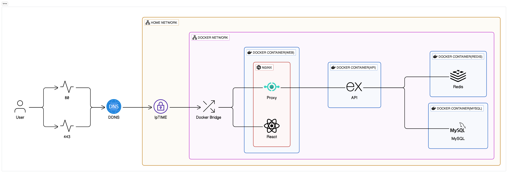

#회고 #프로젝트

## 연결문서
- [index-22년 개인 프로젝트 BMW](../index-22년%20개인%20프로젝트%20BMW.md)

## 아키텍처

 

설명은 외부에서 안으로 진행했지만, 설정 단계는 내부에서 부터 외부로 진행되었다.
- 1차 - Docker Compose를 사용하여 On-premise 서버에 리소스를 관리
- 2차 - Nginx를 사용하여 웹서버 구축 API 서버 Proxy
- 3차 - ipTIME의 DDNS 기능을 사용하여 On-premise 서버를 Public Network와 연결
