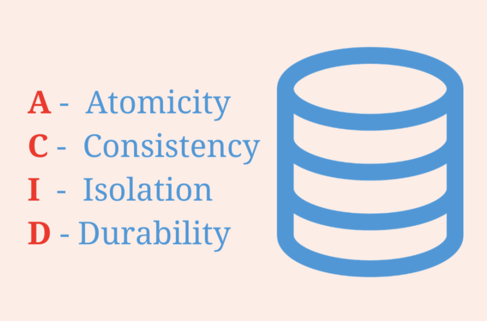
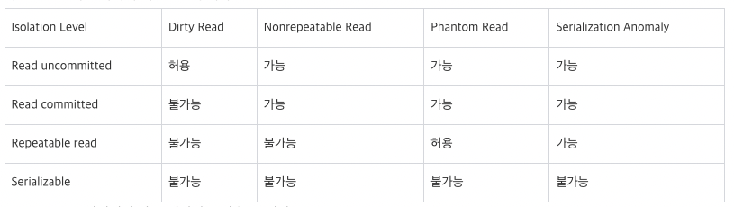

# 트랜잭션(Transaction)과 격리(Isolation)

# 1. 트랜잭션이 필요한 이유?

---

현실의 데이터베이스 시스템은 다양한 이유로 문제가 생길 수 있다

- 데이터베이스 소프트웨어나 하드웨어는(쓰기연산이 실행 중일 때를 포함해서) 언제라도 실패할 수 있다.
- 애플리케이션은 (연속된 연산이 실행되는 도중도 포함하여) 언제라도 죽을 수 있다.
- 네트워크가 끊기면 애플리케이션과 데이터베이스의 연결이 끊기거나 DB 노드 사이의 통신이 안 될 수있다.
- 여러 클라이언트가 동시에 데이터베이스 쓰기를 실행해서 다른 클라이언트가 쓴 내용을 덮어 쓸 수 있다.
- 클라이언트가 부분적으로만 갱신돼서 비정상적인 데이터를 읽을 수 있다.
- 클라이언트 사이의 경쟁 조건은 예측하지 못한 버그를 유발할 수 있다.

이러한 이유 말고 다양한 이유로 대부분의 메이져 RDB는 트랜잭션을 지원한다.

**트랜잭선은 완벽하지 않을 수 있다.

## 트랜잭션이란?

트랜잭션은 DB에서 더 이상 나눌 수 없는 최소한의 작업단위를 말한다.
트랜잭션이 제공하는 안정성을 흔히 ACID라고 말한다.

- A : 원자성(Atomicity)
- C : 일관성(Consistency)
- I : 격리성(Isolation)
- D : 지속성(Durability)

## ACID란?

### 원자성(Atomicity)

원자는 흔히 더 작은 단위로 쪼갤 수 없는 단위를 의미한다. 
그리고 DB에서 말하는 더 작은 단위로 쪼갤 수 없는 원자가 트랜잭션이다.

예를 들어 자금 이체는 성공할 수도 실패할 수도 있지만 보내는 쪽에서 돈을 빼 오는 작업만 성공하고 받는 쪽에 돈을 넣는 작업을 실패해서는 안된다. 원자성은 이 같이 중간 단계까지 실행되고 실패하는 일이 없도록 하는 것이다. 

### 일관성(Consistency)

트랜잭션이 실행을 성공적으로 완료하면, 언제나 일관성 있는 데이터베이스 상태로 유지하는 것을 의미한다.

### 격리성(Isolation)

트랜잭션을 수행 시 다른 트랜잭션의 연산 작업이 끼어들지 못하도록 보장하는 것을 의미한다. 이것은 트랜잭션 밖에 있는 어떤 연산도 중간 단계의 데이터를 볼 수 없음을 의미한다.

### 지속성(Durability)

성공적으로 수행된 트랜잭션은 영원히 반영되어야 함을 의미한다.

이는 오류 발생, 시스템 문제, DB 일관성 체크 등을 하더라도 유지되어야 함을 의미한다. 

** ACID를 보장하는 것은 쉬운일이 아니다. 그렇기 때문에 RDB 벤더마다 ACID를 구현하는 방법에 차이가 있을 수 있고 보장하는 범위나 정의도 다를 수 있다. 
또한 ACID를 엄격하게 지키는 트랜잭션은 안전하지만 속도가 느려질 수 밖에 없는 트레이드 오프를 가진다.
이 때문에 많은 RDB에서는 격리 레벨 설정을 지원함으로 사용자가 유연하게 대응할 수 있도록 옵션을 제공한다.

** 격리 레벨은 크게 4가지로 나뉘며 격리 레벨에 따라 보장하는 격리성도 RDB 벤더마다 다르다. 

# 2. 격리성(Isolation)과 격리 레벨

---

## 격리성에 대한 자세한 설명

현실에서 사용중인 데이터베이스에는 동시에 여러 클라이언트가 접속한다.
동시에 접속한 클라이언트들이 데이터베이스의 다른 부분을 읽고 쓰면 아무런 문제가 발생하지 않는다.
하지만 **여러 트랜잭션이 동시에 동일한 데이터베이스 레코드에 접근하면 동시성 문제가 발생하게 된다.**
이러한 이유로 트랜잭션은 ACID에서 말하는 격리성을 보장한다.

ACID에서 말하는 격리성은 동시에 실행되는 트랜잭션 간에는 서로 격리되어 동작된다는 것을 말한다.
즉, 격리성에 의해 트랜잭션은 다른 트랜잭션을 방해(영향x)하지 못한다.

이러한 격리성은 동시에 접속한 서로 다른 **트랜잭션 처리에 직렬성(serializable)을 가지게 한다.**
직렬성이 보장된 동작을 하게되면, 여러 트랜잭션이 동시에 같은 레코드에 접근하여 쓰기를 실행 했더라도 트랜잭션이 최종적으로 커밋됬을 때의 결과는 마치 여러 트랜잭션이 **순차적으로(하나씩 차례로)** 실행됐을 때의 결과와 동일하도록 동작(보장)한다.

그러나 완벽한 직렬성 격리(Serializable Isolation)은 성능 손해를 동반하기 때문에 현실에서 운용중인 데이터베이스에서는 거의 사용되지 않는다.

위와 같은 이유로 RDB에서는 완화된 격리 레벨을 지원하며, 대부분 메이져 RDB는 4단계 레벨을 지원한다.

## 4단계 격리 레벨(PostgreSQL 기준으로 설명한다.)

SQL 표준은 Transaction Isolation에 대해 4가지 레벨로 정의하고 있다. 

- 이 4가지 중 가장 엄격한 레벨은 Serializable이다.
- PostgreSQL은 Read uncommitted를 제외한 3가지 레벨을 지원한다.
- 3가지만 지원하는 이유는 MVCC 모델에 적용할 수 있는 합리적인 방법이기 때문이다.
    - Read committed, Repeatable read, Serializable 이 3가지를 지원한다.
    - MVCC(다중버전 동시성 제어): 동시 접근을 허용하는 DB에서 동시성을 제어하기 위해 사용하는 모델
- PostgreSQL은 표준을 지키기 위해 문법적으로 Read uncommitted를 지원하지만 실제 내부에 동작은 Read committed으로 동작한다.
- 각 단계는 낮을 수록 [금지 현상](https://www.notion.so/Transaction-Isolation-6e03e42197f54508adcf21c50041669d)을 허용한다.
    - 금지 현상: 완화된 트랜잭션 격리가 유발하는 동시성 버그
    - 종류: dirty read, nonrepeatable read, phantom read, Serialization Anomaly

### Read uncommitted(커밋 되지 않은 읽기)

Read uncommitted는 커밋하지 않은 데이터를 읽을 수 있다.

*가장 낮은 단계로 PostgreSQL에서는 문법적으로만 지원한다.

### Read committed(커밋 후 읽기)

Read committed는 질의 시작 전에 커밋된 데이터만 읽을 수 있다.

  *PostgreSQL의 기본으로 설정된 격리 레벨이다.

### Repeatable read(반복 읽기)

Repeatable read는 트랜잭션 시작 전에 커밋된 데이터만 읽을 수 있다.

### Serializable(직열성)

Serializable은 트랜잭션을 한 줄로 세워 차례대로 진행되는 것과 같은 결과를 보장한다.

*가장 안전하지만 가장 느린 격리 레벨이다.

# 3. 완화된 트랜잭션 격리가 유발하는 동시성 버그 4가지

---

**참고

[트랜잭션 격리 이야기에서 팬텀 읽기 현상](https://postgresql.kr/blog/pg_phantom_read.html)

### dirty read(더러운 읽기)

한 트랜잭션은 다른 트랜잭션에 아직 커밋하지 않은 자료도 읽을 수 있다.

### Nonrepeatable Read( 반복할 수 없는 읽기)

한 트랜잭션은 다른 트랜잭션에서 커밋한 자료를 읽을 수 있다.

처음 어떤 자료를 읽고, 다시 읽으려고 접근할 때, 그 사이 다른 트랜잭션이 자료를 변경하고 커밋 했다면, 
다음 읽는 값은 커밋된 값으로 읽을 수 있다. 

### Phantom Read(팬텀 읽기)

위와 같은 상황에서 다른 트랜잭션에 의해 커밋된 자료가 있다 하더라도, 항상 자신의 트랜잭션에서 조회 했던 그 자료의 값을 그대로 보여준다.

만약 삭제된 자료라도 그대로 보여주기 때문에 이름을 “팬텀 읽기”라고 한다. 

### Serialization Anomaly(직열화 이상)

트랜잭션 그룹을 성공적으로 커밋한 결과는 한 번에 하나씩 모든 트랜잭션을 실행하는 순서와 일치하지 않는다.

## 각 격리 레벨별로 허용하는 현상

# 4. PostgreSQL에서 지원하는 격리 레벨 자세한 설명

---

### Read committed 격리 레벨

- SELECT 질의
    - 질의가 시작했을 때 커밋된 데이터만 접근 가능하고, 트랜잭션 도중에 발생한 커밋되지 않은 수정 사항에는 접근 불가능하다.
    - 질의가 실행중에 커밋되지 않은 데이터 혹은 동시에 실행되고 있던 다른 트랜잭션에서 커밋된 변경에는 접근 불가능하다. **단, 한 트랜잭션에서 SELECT가 여러 번 있고, 각 SELECT 사이에 다른 트랜잭션이 커밋을 했다면 다음에 실행된 SELECT 질의는 변경된 데이터를 읽을 수 있다.**
- UPDATE, DELETE, SELECT FOR UPDATE, SELECT FOR SHARE 질의
    - 검색 측면에서 SELECT 질의와 동일하게 동작한다. 
    트랜잭션 1에서 데이터를 변경하는 도중 트랜잭션 2가 같은 행에 접근하면 트랜잭션 1이 끝난 후에 접근 가능하다. 이때, 외부 트랜잭션에 의해 변경된 행이 현재 명령의 WHERE 조건에 맞는지 다시 평가한다.

### Repeatable read 격리 레벨

- SELECT 질의
    - 트랜잭션이 시작하기 전에 커밋된 데이터만 확인할 수 있다.
    - 외부 트랜잭션에 의해 커밋되거나 커밋되지 않은 변경을 확인할 수 없다. 단, 외부 트랜잭션이 아닌 자신의 트랜잭션 도중에 발생한 커밋되지 않은 수정 사항은 확인할 수 있다.
- UPDATE, DELETE, SELECT FOR UPDATE, SELECT FOR SHARE 질의
    - 행의 검색 측면에서 SELECT 질의와 동일하게 동작한다.
    - 트랜잭션 1에서 데이터를 변경하는 도중 트랜잭션 2가 같은 행에 접근하면 트랜잭션 1이 끝난 후에 변경하려던 행이 변경됐는지 확인해서 변경사항이 없으면 원래 진행하려던 명령을 실행하고, 변경사항이 있으면 에러메시지(`ERROR:could not serialize access due to concurrent update`)를 내면서 트랜잭션을 rollback한다.
    - 읽기만 하는 트랜잭션에서는 에러가 없다.

### Serializable 격리 레벨

- 가장 엄격한 트랜잭션 격리를 제공한다.
- 트랜잭션들이 동시에 일어나지 않고, 한 번에 하나씩 순서대로 실행되는 것처럼 작동한다.
- 잘 고려하여 사용하지 않으면 성능저하가 발생할 수 있다.

# 5. PostgreSQL의 기본 동시성 제어 방법 MVCC

---

일반적인 RDB는 비관적 동시성 제어 또는 낙관적 동시성 제어를 기본으로 사용한다.

반면 PostgreSQL은 기본적으로 MVCC를 사용하여 동시성 제어를 수행한다.

## 낙관적 동시성 제어

사용자들이 같은 데이터를 동시에 수정하지 않을 것이라고 가정한다.

데이터를 읽는 시점에 Lock을 걸지 않는 대신 수정 시점에 값이 변경됐는지를 반드시 검사해야 한다.

## 비관적 동시성 제어

사용자들이 같은 데이터를 동시에 수정할 것이라고 가정한다.

트랜잭션에서 데이터를 읽는 시점에 레코드에 Lock을 하여 다른 데이터가 접근하지 못하게 막는다 그리고 트랜잭션이 종료될때 Lock을 푸는 방식을 사용한다.

SELECT 시점에 Lock를 거는 비관적 동시성 제어는 시스템의 동시성을 심각하게 떨어뜨릴 수 있어서 wait 또는  nowait 옵션과 함께 사용해야 한다.

  

## MVCC(Multi-Version Concurrency Control, 다중 버전 동시성 제어)

Locking 메커니즘의 한계를 극복하기 위해 등장한 방법이다.

MVCC는 동시 접근을 허용하는 데이터베이스에서 동시성을 제어하기 위해 사용하는 방법 중 하나이다. 

MVCC 모델에서 데이터에 접근하는 사용자는 접근한 시점에서 데이터베이스의 Snapshot을 읽는다. 
이 snapshot 데이터에 대한 변경이 완료될 때 (트랜잭션이 commit 될 때) 까지 만들어진 변경사항은 다른 데이터베이스 사용자가 볼 수 없다. 이제 사용자가 데이터를 업데이트하면 이전의 데이터를 덮어 씌우는게 아니라 새로운 버전의 데이터를 UNDO 영역에 생성한다. 대신 이전 버전의 데이터와 비교해서 변경된 내용을 기록한다. 이렇게 해서 하나의 데이터에 대해 여러 버전의 데이터가 존재하게 되고, 사용자는 마지막 버전의 데이터를 읽게 된다. 이러한 구조를 지닌 MVCC의 특징을 정리하면 아래와 같다.

- 일반적인 RDBMS보다 매우 빠르게 작동
- 사용하지 않는 데이터가 계속 쌓이게 되므로 데이터를 정리하는 시스템이 필요하다.
- 데이터 버전이 충돌하면 애플리케이션 영역에서 이러한 문제를 해결해야한다.

### MVCC 정리

MVCC의 접근 방식은 잠금을 필요로 하지 않기 때문에 일반적인 RDBMS보다 매우 빠르게 작동한다. 

또한 데이터를 읽기 시작할 때, 다른 사람이 그 데이터를 삭제하거나 수정하더라도 영향을 받지 않고 데이터를 사용할 수 있다. 대신 사용하지 않는 데이터가 계속 쌓이게 되므로 데이터를 정리하는 시스템이 필요하다.

MVCC 모델은 하나의 데이터에 대한 여러 버전의 데이터를 허용하기 때문에 데이터 버전이 충돌될 수 있으므로 애플리케이션 영역에서 이러한 문제를 해결해야 한다. 

또한 UNDO 블록 I/O, CR Copy 생성, CR 블록 캐싱 같은 부가적인 작업의 오버헤드 발생한다. 
이러한 구조의 MVCC는 문장수준과 트랜잭션 수준의 읽기 일관성이 존재한다.
